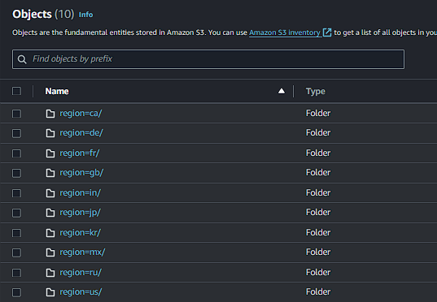

# Overview

The objective of this initiative is to implement a secure, efficient system for the management and analysis of structured and semi-structured data from YouTube videos. This includes categorization and evaluation based on trending metrics.


## Objectives
1. Data Acquisition: Develop a system to gather data from various origins.

2. Data Processing Pipeline: Transforming raw data into a usable format through a robust ETL process.

3. Centralized Data Storage: Utilizing a data lake for aggregating data from diverse sources in a single repository.

4. System Scalability: Ensuring the infrastructure can accommodate growing data volumes without performance degradation.

5. Cloud Integration: Leveraging cloud technologies, specifically AWS, to handle large-scale data processing tasks beyond local computing capabilities.

6. Insights Generation: Creating an interactive dashboard to visualize and analyze key metrics from the processed data.

## AWS services used:
 - Amazon S3

 - AWS IAM

 - Amazon QuickSight

 - AWS Glue

 - AWS Lambda
 
 - AWS Athena

 - AWS CLI

## Dataset overview

This project utilizes a Kaggle dataset comprising daily statistics for trending YouTube videos across several regions, recorded over numerous months. Each region's data is contained in separate CSV files, detailing video and channel titles, publication times, tags, views, likes, dislikes, descriptions, and comment counts. Additionally, a category_id field is included in a region-specific JSON file, linking to the dataset.

**Source -> https://www.kaggle.com/datasets/datasnaek/youtube-new**

## Needed setup

- Run the following command to install the **Kaggle** CLI API, so that the <a href=./kaggle_aws_job.sh>Kaggle to AWS job</a> works properly.
```bash
pip install -r requirements.txt
```

- A local <a href="https://aws.amazon.com/cli/">AWS CLI</a> environment. This step is optional and the browser version, <a href="https://aws.amazon.com/cloudshell/">AWS CloudShell</a>, can be used instead.

- IAM users and roles for the respective services that will be used throughout this project. **DO NOT**, and I repeat, **DO NOT**, and **NEVER** use your root account for anything, specially for this.

## Initial ELT

### Kaggle to AWS [Extract-Load]

#### 1 - Set up the S3 buckets that will be used to store our data for the time being.


In **_raw_statistics_reference_data_**, our JSON files will be saved, as for **_rawstatistics_**, that's where we will have our CSV files.

#### 2 - Run the job to do the following: [Extract-Load]
- Set the dataset download path to current working directory

- Download the dataset from Kaggle

- Extract the dataset, since it comes in the ZIP format

- Look recursively for both JSON and CSV files, and **copy** them to our buckets

```bash
./kaggle_aws_job.sh
```

_Note: It is relatively easy to change the S3 buckets paths, but for the sake of this specific project, the CSV files are partitioned by region, and the script that sends these files to their S3 bucket is hard coded to do the same as well._



#### 3 - Catalog the reference data [Load]

The reference data will now be crawled using <a href="https://aws.amazon.com/glue/" target='blank'>**AWS Glue**</a> **Data Catalog**'s feature: Crawler.

##### 1 - Create new crawlers for both the JSON and CSV files, and choose the S3 path to their respective buckets. After creating them, run both of them. This will allow us to query this data directly from the catalog using <a href="https://aws.amazon.com/pt/athena/">**AWS Athena**</a>.


###### 2 - And create the respective database. I suggest you name it based off the actual S3 bucket, so it makes your life easier.


###### 3 - Create a new S3 bucket, and set it as the output location for the <a href="https://aws.amazon.com/pt/athena/">**AWS Athena**</a> queries.


And even after all that, there is still a problem though, which is the fact that we can not use this data directly from <a href="https://aws.amazon.com/pt/athena/">**AWS Athena**</a> because of how it is structured.


So transformation will be done on top of this data, so we can further proceed.

### From JSON to Parquet [Transform]

#### 1 - Create a different database for the clean data. You can do so either through <a href="https://aws.amazon.com/glue/" target='blank'>**AWS Glue**</a> interactively, or using SQL through <a href="https://aws.amazon.com/pt/athena/">**AWS Athena**</a>. We will be sticking to the SQL alternative for now, since we are already in this screen.


#### 2 - Set up a new S3 bucket for the clean data to be saved.

For this transformation, <a href="https://aws.amazon.com/lambda/" target=blank>AWS Lambda</a> will be used for the <a href="./lambda_function.py">lambda function</a> from this repository.

Here are the enviroment variables being used with it for this project.


#### 3 - Set the trigger to the function being a new object being put into the **raw data** bucket.

It is possible to test the function by using the **s3_put** event template as well.


#### 4 - Deploy and test the function.

If you see something like this from the test event:


Then it worked successfully.

#### 5 - Edit the schema of the newly created table.

Set the column **id** data type from **string** to **bigint**, and save the new table version.

_Note: At this point, it is better if you delete the previous files cleaned from the lambda function, and if needed, rerun the lambda function. Because these old files still go by the old schema._


## Final ETL

### [Extract-Transform-Load]

For this one, the <a href=./pyspark_etl_csv_to_parquet.py>CSV to Parquet Glue job</a> will be run to do the following respectively:
 - Extract the CSV data from the **rawstatistics** table created from the previous crawler run on top of the CSV files

 - Transform integers from **string** to **bigint**, change its format from CSV to Parquet, create a new table in the **Data Catalog**, in the database **de_haguz_cleaned**, named **cleaned_statistics**, partiotined by the column **region**

 

 - And have it loaded directly into the cleaned data bucket, as well as into Athena, in their respective cleaned version.

 After running the job, you should now be able to query the cleaned data as well!

 Here is some SQL for testing:

 ```SQL
SELECT
    main.title
    , main."views"
    , main.likes
    , main.dislikes
    , main.category_id
    , reference.snippet_title
FROM "de_haguz_cleaned"."cleaned_statistics" main
INNER JOIN "de_haguz_cleaned"."cleaned_statistics_reference_data" reference
ON main.category_id = reference.id
WHERE region = 'ca'
LIMIT 10;
 ```

 It will retrieve data from the main dataset, and perform a join on the reference dataset to find the category of the main dataset's video, based on their respective IDs.

 